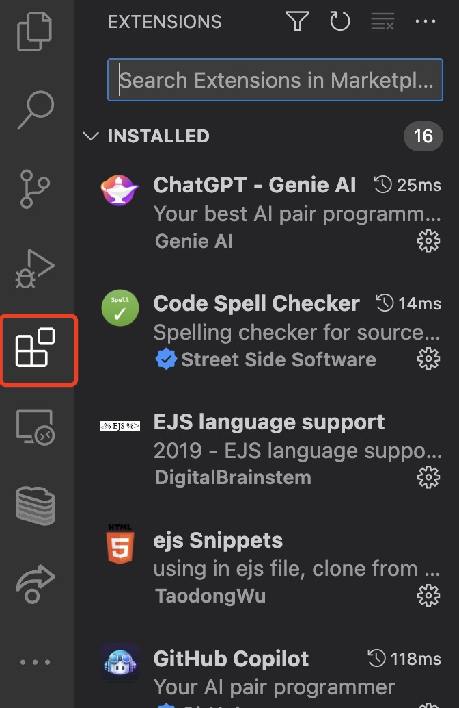
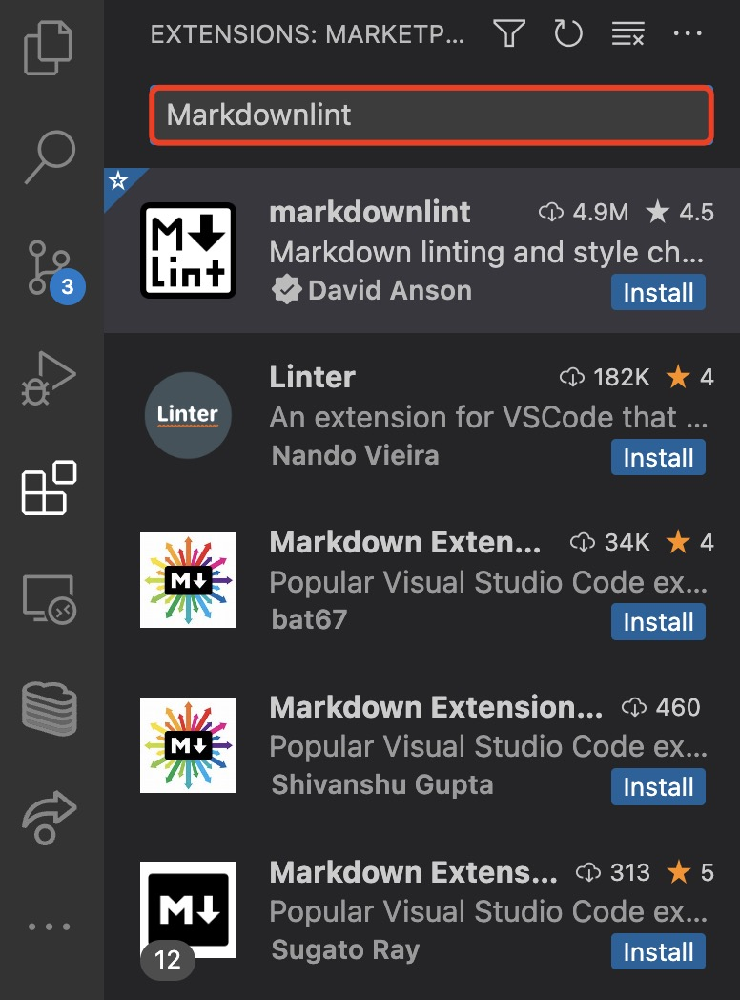
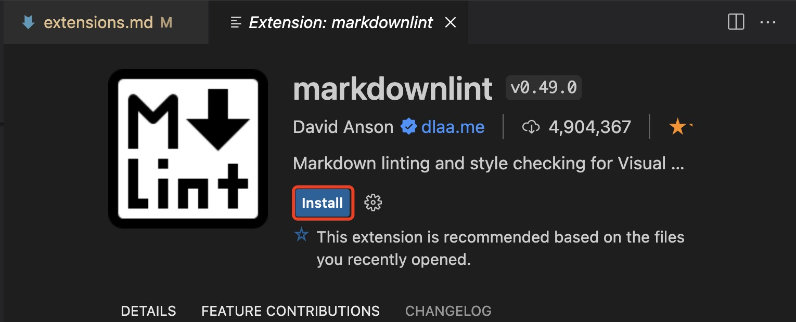
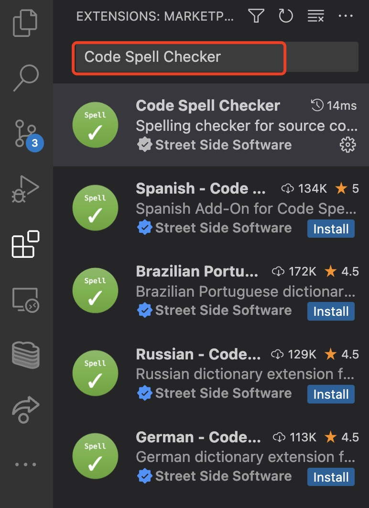
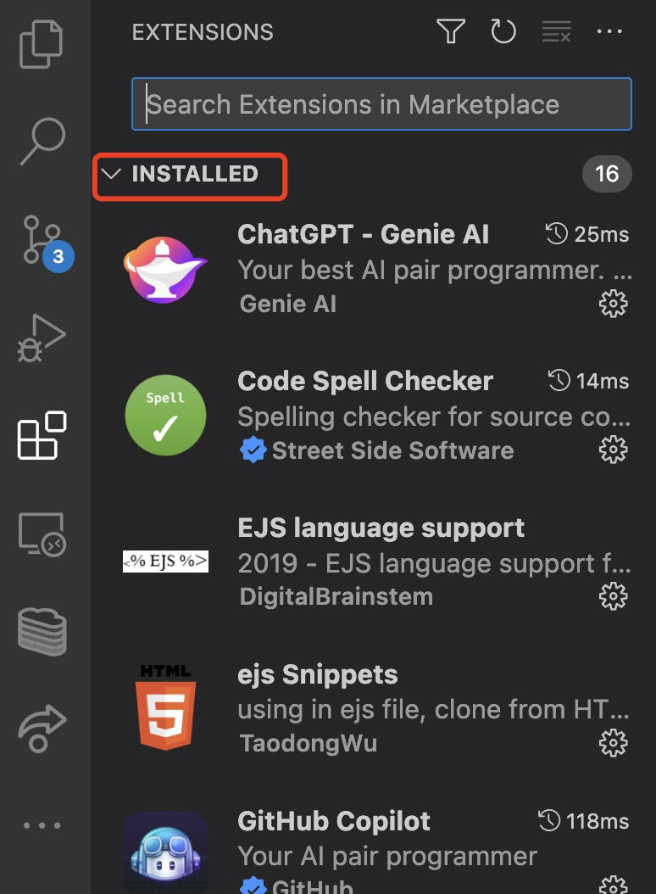
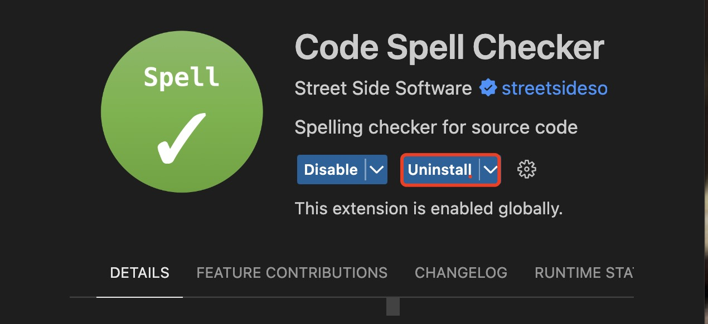

# Overview

This section will detail how to manage your [VS Code](https://code.visualstudio.com/learn) extensions. Extensions help you as a developer get the most functionality out of VS Code.

## Installing Extensions

VS Code makes installing extensions simple! Follow the steps below to begin now. In this example we will be installing the Code Spell Checker extension to help check for spelling errors!

1. Select the **extensions** tab located on the left nav bar from the landing page of your VS Code app. An _extensions tab_ will appear to the left of your screen.

    !!! info "Info"
        The extensions tab may also be accessed by typing Ctrl + Shift + X on the keyboard.

    <figure markdown>  
        
    </figure>

2. Search for the extension you want using the _search bar_ located at the top of the newly formed extension tab.

    <figure markdown>
        
    </figure>

3. Click on the extension you wish to download.

4. Click the **install** button. Congratulations! 🎉 You've installed an extension.

    !!! success "Success"
        

## Uninstalling Extensions

Occasionally, extensions become [depreciated](https://code.visualstudio.com/updates/v1_76) or you may have no more use for them. The follow the steps below to uninstall!

1. Select the **extensions** tab located on the left nav bar from the landing page of your VS Code app. An _extensions tab_ will appear to the left of your screen.

    !!! info "Info"
        The extensions tab may also be accessed by typing Ctrl + Shift + X on the keyboard.

    <figure markdown>
        
    </figure>

2. Search for the extension you want using the search bar located at the top of the newly formed _extension tab_.

    <figure markdown>
        
    </figure>

3. Find the extension you wish to uninstall under the _installed_ tab.

    <figure markdown>
        
    </figure>

4. Select the extension and click **uninstall**.

    !!! success "Success"
        