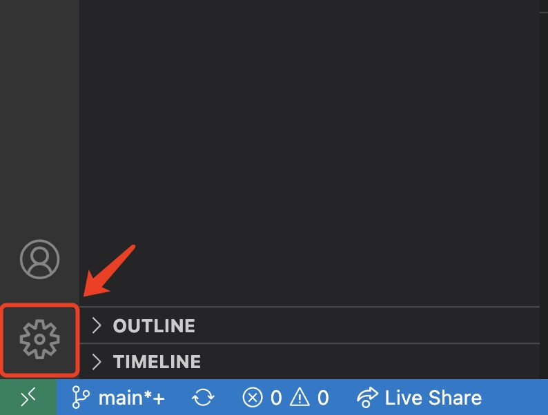
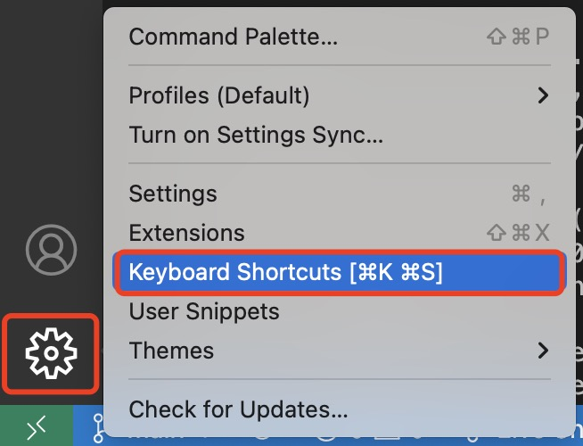
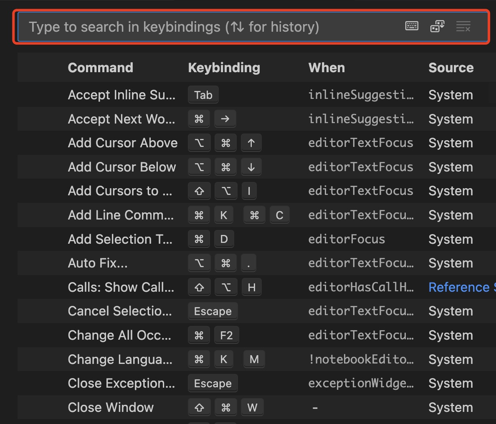
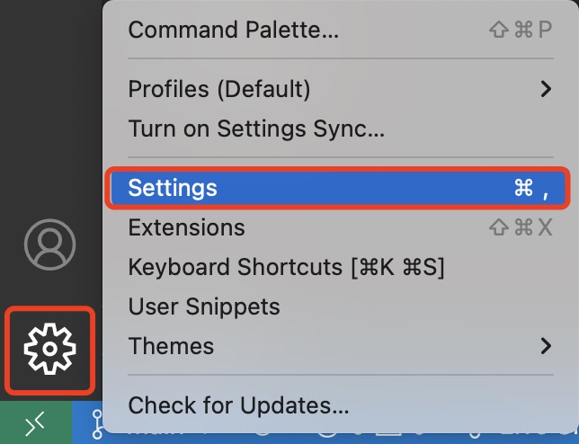
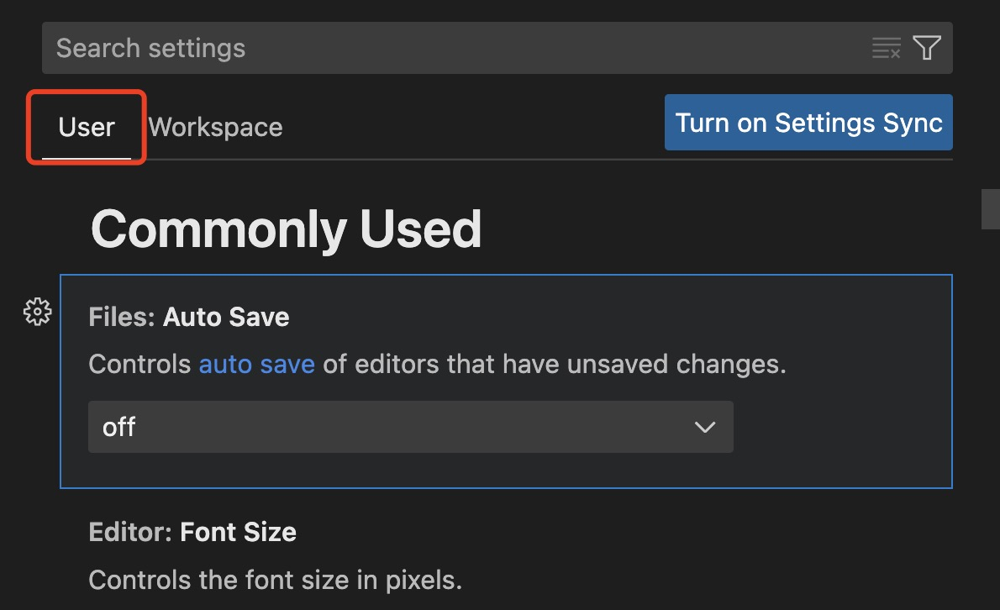

# Overview

You are a developer now! As such it is important to know how to navigate and work the many settings of [VS Code](https://code.visualstudio.com/learn). 

This section will detail how to manipulate save settings and hotkey manipulation.

## Customizing Hotkeys

VS Code offers a variety of hotkeys to help you save time as you work. In this example we will be setting the hotkey _Alt + z_ to autoformat text.

1. Open VS Code, from the landing page **select** the manage icon on the bottom of left navbar. 


2. Select **key board shortcuts** from the popup. A new window will open present with all hotkeys VS Code offers. 

You can manage all the hotkeys on this window, and check the hotkeys for your current OS.

3. Type the following in the search bar:

```{.js .annotate}
Terminal: Toggle size to content width
```

Toggle size to content width helps you autoformat your text to fit your current window size.

4. **Select** the shortcut from the search results. A popup window will appear prompting you to enter your desired shortcut.


5. Type your shortcut in the popup text box and hit **enter** to save your changes. We recommend _Alt + Z_. 


## Customizing Save Settings

It is important to always save your work. Nothing is more frustrating than working an a problem for hours only to loose all your progress because you did not save. Luckily, VS Code offers autosave features customizable by time, and user actions.

Here we will demonstrate how to customize your autosave to be preformed after switching to a new tab.

1. Open VS Code, from the landing page **select** the manage icon on the bottom of left navbar. A popup menu will appear as the image below.


2. Select **settings** from the popup menu. A new window will open present with save settings.


3. **Select** the commonly used bar located under the user tab.Off is the default option that will disable autosave.

4. **Select** the dropdown menu under _Files: Autosave_ and choose _OnFocusChange_.onFocusChange auto-saves files both when you switch windows on your computer and when you switch tabs within VSCode.