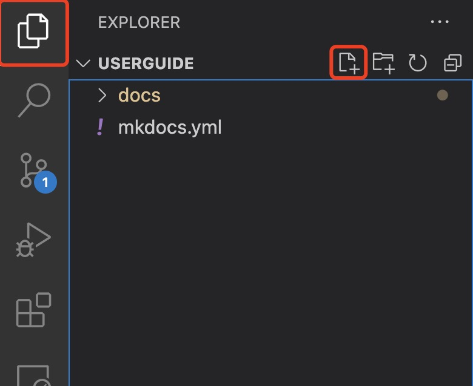
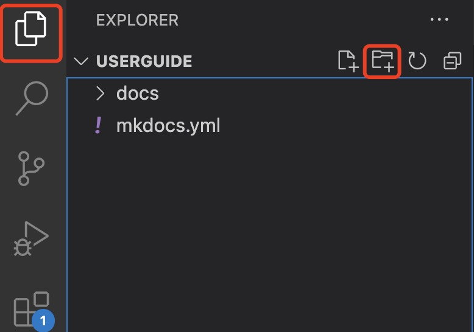
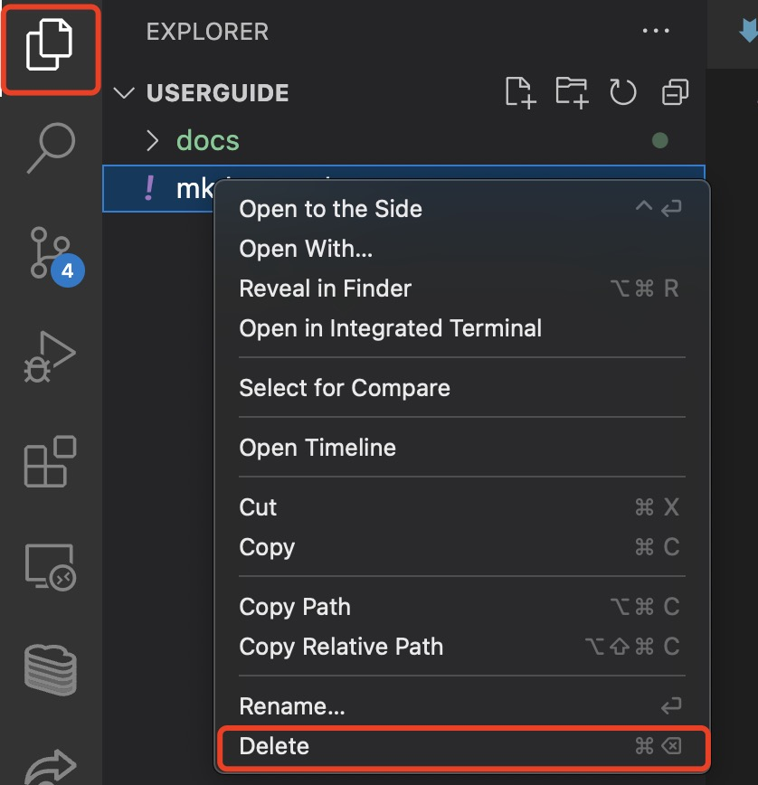
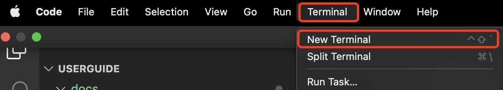

# Overview

So you want to start your first project. Luckily VS Code may be easily linked to [GitHub](https://github.com/) to ensure your changes are tracked and collaborating made easy!

Follow the steps below to start a project and upload the repository to your GitHub!

## Starting a project from local computer

Before starting a project it is important to add it to a GitHub repository. This will allow for any backups to be recovered in the event your local computer is compromised. There is also the added benefit of easy collaboration!

The following steps will guide you to creating a GitHub repository locally from VS Code.

1. Open VS Code, from the upper navbar select **terminal** and open a new terminal. A _terminal_ will appear towards the bottom of the screen.

    !!! info "Info"
        A new Terminal may also be opened by typing Ctrl + Shift + ` on the keyboard.

    <figure markdown>
        
    </figure>

2. Type the following and press enter in the newly opened _terminal_.

    !!! warning "Warining"
        Ensure the terminal window is opened into the directory of your project or you will not publish the correct files to GitHub.

    ```{.js .annotate}
    git init
    ```

Congratulations! You have just set a new repo up to you GitHub!

## Adding Files to your project

When making a project, everything cannot be stored under one file! Follow the steps below to generate a new file.

1. Select the **new File** icon under the _explorer_ tab. A new blank file will appear.

    <figure markdown>
        
    </figure>

2. Name the file and add an extension. Hit enter to finalize any changes.

    !!! warning "Warning"
        Ensure you use the correct file extensions or your project will not work properly.

## Adding Folders

Often when working on larger projects it is important to group similar files into folders for better organization. Follow the steps below to generate a new folder!

1. Select the **new Folder** icon under the _explorer_ tab. A folder will appear.

    <figure markdown>
        
    </figure>

2. Name the folder. Hit enter to finalize any changes.

    !!! warning "Warning"
        When moving files into folders ensure that the file paths are updated relative to the new folder.

## Deleting Files / Folders

Sometimes throughout the course of your project files of folders become redundant or no longer needed. Follow the steps below to delete a file / folder!

1. Right click the **file / folder** you wish to delete under the _explorer_ tab. A menu will appear.

2. Select **delete** in the new menu. The file / folder is now deleted!

    !!! warning "Warning"
        When deleting a file / folder VS Code deletes the file / folder permanently. Double check your actions before deleting.

    <figure markdown>
        
    </figure>

## Pushing to GitHub

After making changes to your project it is time to push your changes to GitHub. This allows for a backup of your work to be saved on the web and if collaborating with others, your peers to also see the changes you made. Follow the steps below to push your changes to GitHub!

1. Open VS Code, from the upper navbar select **terminal** and open a new terminal. A _terminal_ will appear towards the bottom of the screen.

    !!! info "Info"
        A new Terminal may also be opened by typing Ctrl + Shift + ` on the keyboard.

    <figure markdown>
        
    </figure>

2. Type the following in the newly opened terminal and press enter.

    ```{.js .annotate}
    git add .
    ```

    This command will let git know which files to push to GitHub

    !!! warning "Warning"
        Ensure the terminal window is opened within the root directory of your project or git commands may not work.

3. Type the following into the terminal

    ```{.js .annotate}
    git commit -m"my first commit"
    ```

    This command will add a helpful comment to describe the changes made. Replace _"my first commit"_ with a helpful message detailing what changes you made.

4. Type the following into the terminal

    ```{.js .annotate}
    git push
    ```

    !!! warning "Warning" 
        Ensure that your local project copy is up to date before pushing.

    Congratulations! You have successfully pushed your changes onto GitHub!